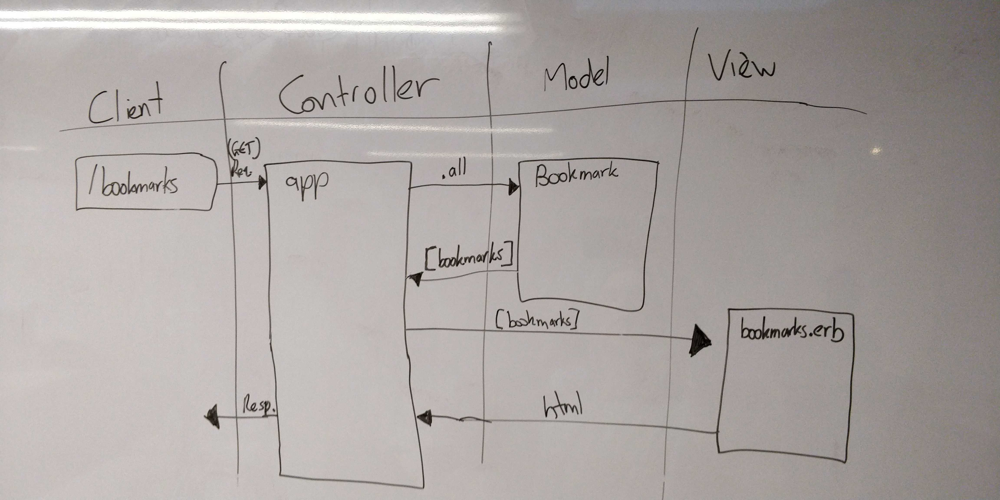

# Bookmark Manager App

Alex's Domain Model for User Story 1:

Habakkuk's Domain Model for User Story 1:

To run app:

Create database named bookmark_manager:
  createdb bookmark_manager

Connect to database:
  EITHER:
    psql bookmark_manager
  OR:
    psql
    \c bookmark_manager

Create table with id and url columns:
  EITHER:
    CREATE TABLE bookmarks(id SERIAL PRIMARY KEY, url VARCHAR(60));
  OR:
    run ./db/migrations/01_create_bookmarks_table.sql

Check that the table was successfully created:
  \dt
  Expect to see:
      List of relations
    Schema |   Name    | Type  |     Owner
    --------+-----------+-------+---------------
    public | bookmarks | table | habakkukryong
    (1 row)

To set up test database:
  run ./db/migrations/02_create_bookmarks_table_test.sql
